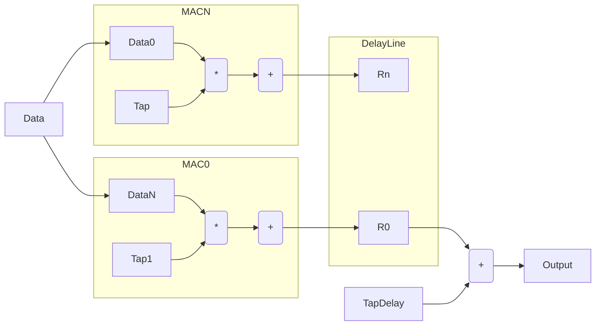
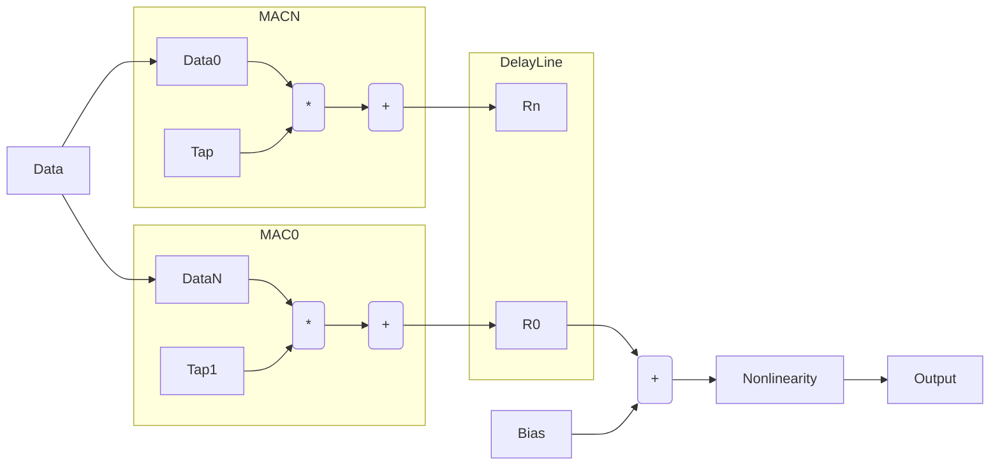

# Hardware Architecture

There are many different architectures possible for neural networks and all are possible using
this toolset. This section defines the initial architecture chosen which minimizes complexity
for the current example design.

A neural network consists of chaining stages together. 

# Top Level Architecture 
TBD
# Memory Layout Architecture
TBD

# Neural Stage 

This block contains a set of Neurons and is designed in a way to support the 3 basic Network operations using the same structure 
driving the inputs slightly differently. The different algorithms are all Matrix operations so the structure is designed to handle the 3 
operations with slightly different orderings. 

## Feedforward operation

For feedforward the operation is just a simple matrix multiplication with a bias addition. The ordering of this block was selected to keep memory access at a minimal level and to keep the 
operations running at a lower rate (bias addition, non-linearity) to be time shared. A block diagram
of the operation is shown below. 

The block contains N MAC units which are shared for the operations. The data is ordered in a way to share the accumulator and limit memory accesses. 
The access is shown in the table below for a matrix with K MAC units and N total operations. The operation
order is always done so that K total outputs are completely computed before starting the next calculation. 
This ordering allows all the lower rate elements to be shared. 

| Type          | 0       | 1      | K      | K+1     | N       |
| ------------- |:-------:| ------:| ------:| -------:| -------:|
| Tap (Vector)  | T0      |   T1   |   TK   | T(K+1)  | TN      |
| Data          | D0      |   D1   |   DK   | D0      | DK      |
| Bias          | B0      |   B1   |   BK   | B0      | BK      |

The advantage of the ordering above is that the data is accessed linearily to minimize access 
and the accumulator is always used to update the outputs avoiding the use of an adder tree. 

## Error Update operation

The error update calculation uses the same structure as above with a slightly different input configuration 
to the MAC units and some addition glue logic to handle this operation. The error update operation is also
a matrix multiply operation but uses error as input to the matrix multiply instead of the taps. 

The block diagram of the operation is shown below. 

    
The operation shown above is very similar to the feedforward operation with the following differences 
1. The tap input is the error. This is made more efficient by storing the tap and error in the same memory
2. The output of the block is parallel and is written to the tap memory
3. The bias update is not shown but is done in a similar fashion as the tap update using a parallel 
adder

The ordering of the operations is shown below

| Type          | 0       | 1      | K      | K+1     | N       |
| ------------- |:-------:| ------:| ------:| -------:| -------:|
| Tap (Vector)  | E0      |   E1   |   EK   | E(K+1)  | EN      |
| Data          | D0      |   D1   |   DK   | D0      | DK      |
| Bias          | B0      |   B1   |   BK   | B0      | BK      |

## Back Propagation

Back propagation is also a matrix multiplication operation between the taps and the error and like 
the previous two updates uses the same basic structure and ordering. 

There is an issue with this algorithm in that it uses the transpose of the taps which slightly complicates the memory access. To get around 
this problem while keeping the same structure the taps are accessed from memory in an offset fashion 
which is shown in the table below. 

| Type          | 0       | 1      | K      | K+1     | N       |
| ------------- |:-------:| ------:| ------:| -------:| -------:|
| Tap0          | T0      |   T1   |   TK   | T(K+1)  | TN      |
| Tap1          | T1      |   T2   |   T0   | T(K+1)  | TN      |
| TapK          | TK      |   T0   |   T1   | T(K+1)  | TN      |
| Data0         | E0      |   E1   |   EK   | ..      | ..      |
| Data1         | E1      |   E0   |   ..   | ..      | ..      |
| DataK         | E2      |   E2   |   ..   | ..      | ..      |

