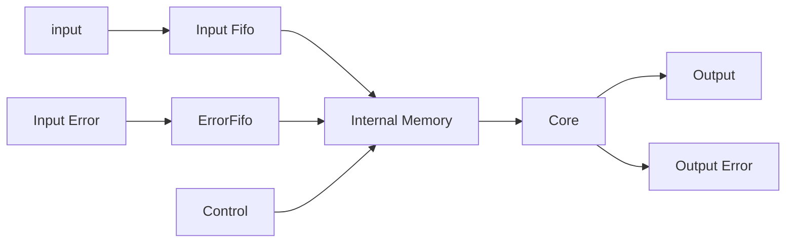
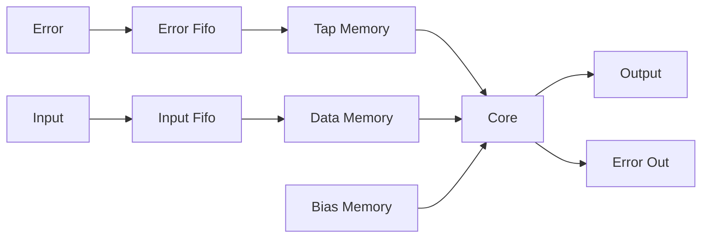
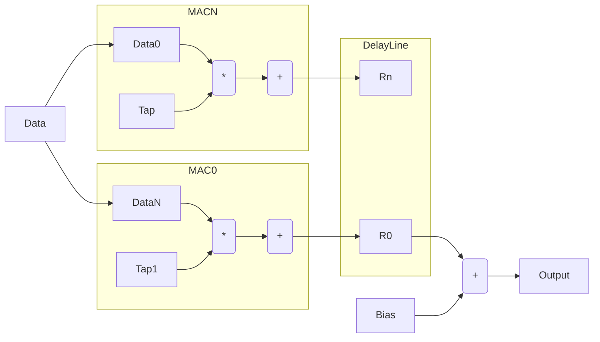
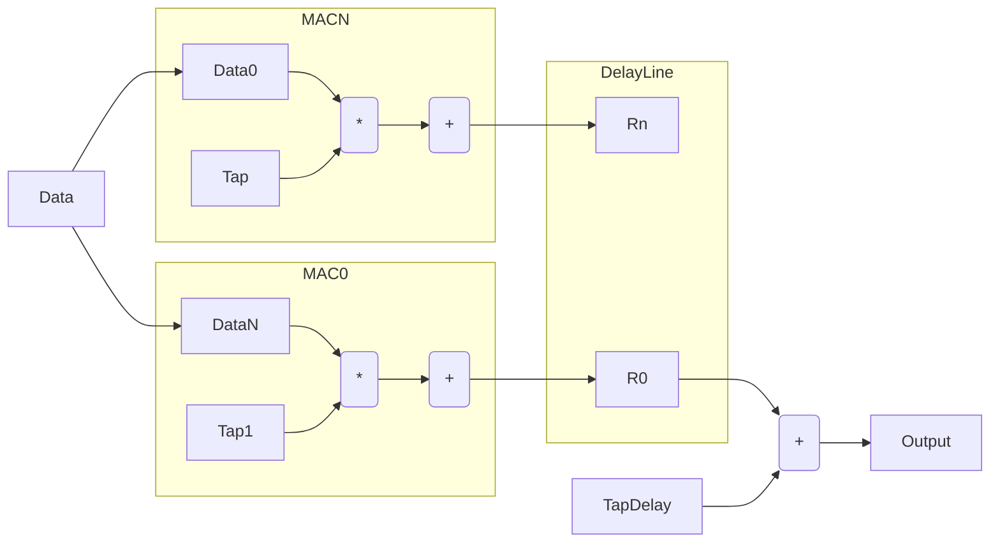
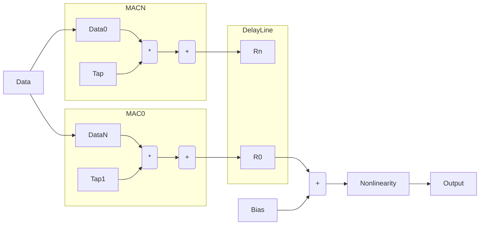

# Hardware Architecture

There are many different architectures possible for neural networks. This section defines the initial architecture chosen usign this toolset which minimizes complexity for the example design. Like most hardware designs the proper algorithmic solution varies depending
on the use case. There are also some faults and bad initial decisions for this architecture which were not found until later in the design effort so have been left there to be fixed/changed at a later time. 

The worst decision was the use of floating point which was actually a new addition to this toolset. The initial thought would be it would simplify the design from an algorithmic perspective but in reality just led to issues in complicating debug. This is first on the list for removal for a practical design. Further discussion of architectural choices can be found at the bottom of this section. 

# Top Level Architecture 

The top level architecture for this design consists of a 

The building block for the design in terms of interfaces is shown below.  

Each stage of the network has an interface which consists of the following main interfaces. 
All of the interfaces use a ready valid format to gate the data. 
Currently the inputs to the stages contain fifos for flow control with the outputs streaming even 
though the interfaces are ready valid. The assumption currently is that a full operation is completed 
before it is interrupted. 

### Operation

The operation of the network is straightforward and does not have any external control. Each stage of the network does 3 basic operations which are done using the same hardware and are time multiplexed based on the ordering below. 

1. Error Back Propagation
1. Tap/Bias Updates
1. Feedforward Propagation

This order of operations should lead to the maximum network throughput while minimizing memory access. This operation is shared to due to it's access of the same information from memory. Parallel operation is also possible but would require more complicated and higher rate memory access. While sharing this unit is possible, it is probalby more efficient to add parallel stages working on different data rather than attempting to speed up these operations. 

## Neural Network Stage

Each stage of the network is self contained block which contains a set of control as well as memory. A high level block diagram is shown below. 

This architecture was selected for simplicity but is not required. Sharing between stages as well as setting up resource pools for sharing is possible. For the current use cases there didn't seem to be advantages due to the full loading of the memories. 

## Memory Layout 

The memory for each stage is split into 3 separate memories based on their size and frequency of use. 

1. Data Memory
1. Bias Memory
1. Tap and Error Memory

The memory size and depths have been calculated to keep the network fully utilized. The internal network parameters are somewhat obvious as they are directly related to the size of the network operation. The depths of the error and data are less obvious and directly effect the throughput of the network. This is due to the data being required for the tap updates so must be accessible when the error is fedback. 

### Data Memory
The data memory contains the input data to the stage. This information is required for both the feedforward operation of the stage and the error updates. 

1. The memory read requires one data sample per stage calculation. 
1. The depth of the memory is a function of the maximum error feedback time and throughput requirements

### Bias Memory

The bias memory contains the bias values from the network. 

1. The memory read requires one data sample per stage calculation. 
1. The depth of this memory is equivalent to the amount of neurons in the stage

### Tap and Error Memory
This is a parallel memory which has an output width which is a multiple of the number of MAC units used in the stage. The tap memory contains both the tap values for the stage as well as the error which simplifies the interface to the stage and reduces the memory requirements. 

1. The memory requires one parallel read (number of neurons width) for each operation of the neural stage
1. The depth of the memory is equivalent to the size of the taps plus the required error storage. 

The memory is assumed to have read/write access to individaul taps as well as the full set of parallel taps. This is used for 

1. Loading the Error into memory
2. Reading the Transposed Taps out for BackPropagation

## Neural Core Architecture 

The core of the neural stage contains a set of MAC units and some glue logic which supports the required network operations. 

* Feedforward operation
* Error Backpropagation
* Tap/Bias Updates

These are all matrix operations and utilize the same basic underlying set of MAC units with different ordering of the inputs. In general the block has the structure shown below with slight variations to handle the different matrix operations. 

## Feedforward operation

The feedforward operation is a matrix multiplication with a bias addition.  The data flow is ordered to always work with MAC operations and avoid the use of an adder tree. 

A block diagram of the operation is shown below. 

The block contains N shared MAC units, a delay line, a bias addition and a nonlinearity. The data flow operates as follows : 

1. The input data is multiplied by the tap 
2. The result is accumulated unless it is the first operation
3. When the operation is complete the data is latched at the output into the delay line
4. This delay line is then fed into the bias addition serially. `This could/should be done using the accumulator`
5. The output of the bias addition block is fed into the nonlinearity and output

The access ordering is shown in the table below for an example which has K MAC units and N total inputs. The ordering is always done so that an output is completed without having to be stored back into memory. 

| Type          | 0       | 1      | K      | K+1     | N       |
| ------------- |:-------:| ------:| ------:| -------:| -------:|
| Tap (Vector)  | T0      |   T1   |   TK   | T(K+1)  | TN      |
| Data          | D0      |   D1   |   DK   | D0      | DK      |
| Bias          | B0      |   B1   |   BK   | B0      | BK      |

## Error Update operation

The error update calculation uses the same structure as the feedforward operation with a different input configuration. For this case the values used in the update equation are the error and the taps instead of the taps and data. 

The block diagram of the operation is shown below. 

    
The operation shown above is very similar to the feedforward operation with the following differences 

1. The tap input is the error (This is made more efficient by storing the tap and error in the same memory)
2. The output of the block is parallel and is written to the tap memory
3. The bias update is a scalar addition not shown in the diagram which uses the error directly

The ordering of the operations is shown below

| Type          | 0       | 1      | K      | K+1     | N       |
| ------------- |:-------:| ------:| ------:| -------:| -------:|
| Tap (Vector)  | E0      |   E0   |   E0   | E1      | E1      |
| Data          | D0      |   D1   |   DK   | D0      | DK      |
| Bias          | B0      |   B1   |   BK   | B0      | BK      |

For this case, the error is kept constant while the data is changing at the input. 

## Back Propagation

Back propagation is similar in operation to both feedforward operation and the tap updates. This algorithm differs in that it uses the transpose of the taps which requires some reordering to avoid the need for an adder tree. This operation uses the transpose of the taps in the tap location and the error in the data port. 

There is an issue with this algorithm in that it uses the transpose of the taps which slightly complicates the memory access. To get around this problem while keeping the same structure the taps are accessed from memory in an interleaved fashion as shown below. The table below shows this operation which does the following things : 

1. Rotates the tap address on a per tap basis
1. Rotates the data as well using a delay line

| Type          | 0       | 1      | K      | K+1     | N       |
| ------------- |:-------:| ------:| ------:| -------:| -------:|
| Tap0          | T0      |   T1   |   TK   | T(K+1)  | TN      |
| Tap1          | T1      |   T2   |   T0   | T(K+1)  | TN      |
| TapK          | TK      |   T0   |   T1   | T(K+1)  | TN      |
| Data0         | E0      |   E1   |   EK   | ..      | ..      |
| Data1         | E1      |   E0   |   E1   | ..      | ..      |
| DataK         | E2      |   E2   |   EK+1 | ..      | ..      |

# Future Directions for Architecture
