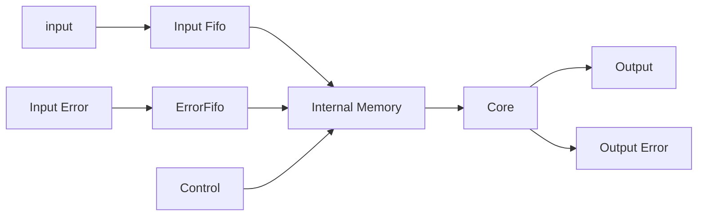

# Hardware Architecture

There are many different architectures possible for neural networks. This section defines the initial architecture chosen usign this toolset which minimizes complexity for the example design. Like most hardware designs the proper algorithmic solution varies depending
on the use case. There are also some faults and bad initial decisions for this architecture which were not found until later in the design effort so have been left there to be fixed/changed at a later time. 

The worst decision was the use of floating point which was actually a new addition to this toolset. The initial thought would be it would simplify the design from an algorithmic perspective but in reality just led to issues in complicating debug. This is first on the list for removal for a practical design. Further discussion of architectural choices can be found at the bottom of this section. 

# Top Level Architecture 

The top level architecture for this design consists of a 

The building block for the design in terms of interfaces is shown below.  

Each stage of the network has an interface which consists of the following main interfaces. 
All of the interfaces use a ready valid format to gate the data. 
Currently the inputs to the stages contain fifos for flow control with the outputs streaming even 
though the interfaces are ready valid. The assumption currently is that a full operation is completed 
before it is interrupted. 

### Operation

The operation of the network is straightforward and does not have any external control. Each stage of the network does 3 basic operations which are done using the same hardware and are time multiplexed based on the ordering below. 

1. Error Back Propagation
1. Tap/Bias Updates
1. Feedforward Propagation

This order of operations should lead to the maximum network throughput while minimizing memory access. This operation is shared to due to it's access of the same information from memory. Parallel operation is also possible but would require more complicated and higher rate memory access. While sharing this unit is possible, it is probalby more efficient to add parallel stages working on different data rather than attempting to speed up these operations. 

