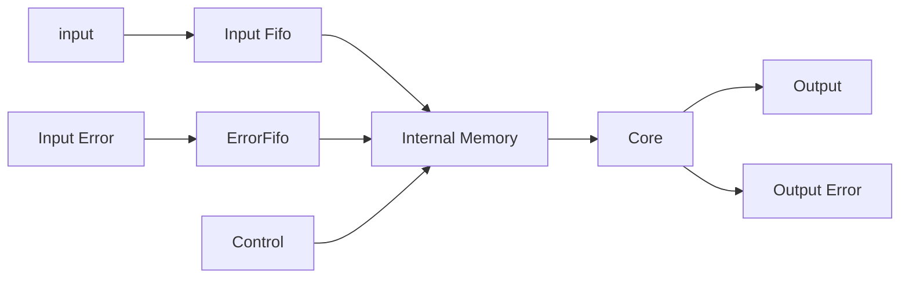

# Hardware Architecture

There are many different architectural tradeoffs which are possible for neural networks. This section defines an architecture chosen which minimizes complexity for the example design and most likely a large subset of designs. Like most hardware designs the proper architectural solution varies depending on the use case so different configurations are possible. 

This section will discuss the architecturce which was selected for the initial design as well as follow up with possible future improvements. 

# Top Level Architecture 

The top level architecture for this design consists of a set of a top level which contains a set of independent stages attached using FIFOs on the block input path and streaming interfaces on the outputs. A basic block diagram is shown below. 

graph LR;

input-->stage0
stage0-->|output|stage1
stage1-->|error|stage0
stage1-->|output|stageN
stageN-->|error|stage1
stageN-->|output|error
error-->|error|stageN

Each block outputs the results of the feedforward operation and inputs the error from the future block in the chain for use in back-propagation mode for the network. 

## Main Building Block

The building block for the design is shown in the block diagram below at a high level below. The block consists of 

* Fifos for the inputs (Input Data forward, Error Data Backward)
* Memories to store the state of the model
* Core Neuron Logic which contains the MAC, Nonlinearity and required glue logic

### Operation

The operation of the network is straightforward and does not have any external control. Each stage of the network does 3 basic operations which are done using the same hardware and are time multiplexed based on the ordering below. 

1. Error Back Propagation
1. Tap/Bias Updates
1. Feedforward Propagation

This order of operations should lead to the maximum network throughput while minimizing memory access. This operation is shared to due to it's access of the same information from memory. Parallel operation is also possible but would require more complicated and higher rate memory access. While sharing this unit is possible, it is probalby more efficient to add parallel stages working on different data rather than attempting to speed up these operations. 

