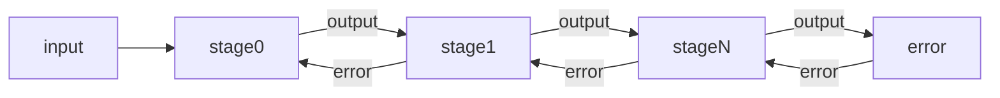
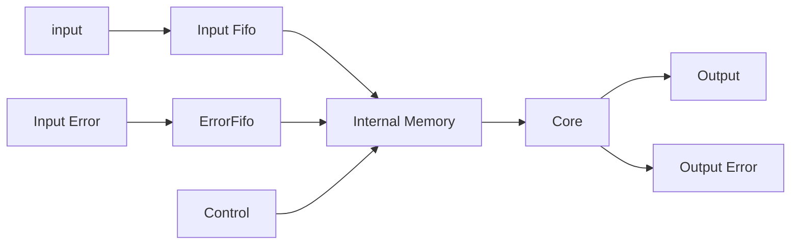

# Hardware Architecture

There are many different architectural tradeoffs possible for neural networks. This section defines an architecture chosen which minimizes complexity for the example designs used and most likely a large subset of designs. Like most hardware designs the proper architectural solution varies depending on the use case. The infrastructure supports architectural changes so that designs can be targetted to the exact requirements. 

# Top Level Architecture 

The top level architecture for this design consists of a set of independent stages attached using FIFOs on the block input path and streaming interfaces on the outputs. This choice was selected to avoid the complexity of having the internal neural stages support different operations in parallel. Each stage does the complete feedforward operation, tap update or back propagation work until complete.  

A basic block diagram is shown below. 

Each block outputs the results of the feedforward operation and inputs the error from the future block in the chain for use in back-propagation mode for the network. 

## Main Building Block

The main building block of the design is shown below and consists of 

* Fifos for the inputs (Input Data forward, Error Data Backward)
* Memories to store the state of the model
* Core Neuron Logic which contains the MAC, Nonlinearity and required glue logic

## Operation

The operation of each stage of the network is self contained. Each stage of the network does 3 basic operations which are done using the same hardware and are time multiplexed based on the ordering below. 

1. Error Back Propagation
1. Tap/Bias Updates
1. Feedforward Propagation

-----

The precedence of these operations was selected to maximize network throughput and minimize memory depth by giving precedence to feeding the error backward. This choice propagates the error back through the network as quickly as possible to minimize delay and required memory depth. 

