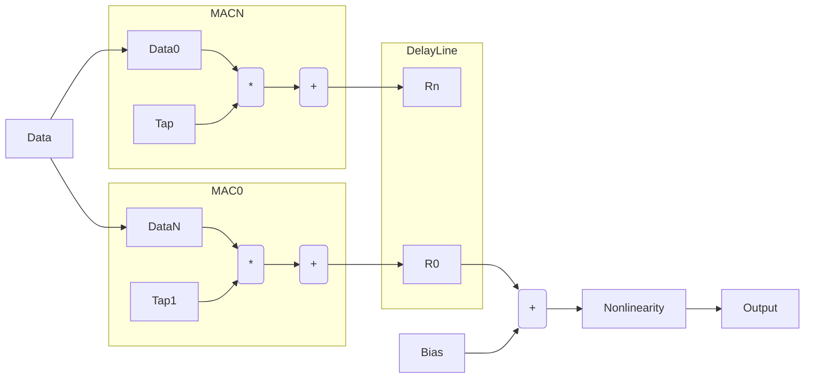

## Back Propagation

Back propagation is similar in operation to both feedforward operation and the tap updates. This algorithm differs in that it uses the transpose of the taps which requires some reordering to avoid the need for an adder tree. This operation uses the transpose of the taps in the tap location and the error in the data port. 

There is an issue with this algorithm in that it uses the transpose of the taps which slightly complicates the memory access. To get around this problem while keeping the same structure the taps are accessed from memory in an interleaved fashion as shown below. The table below shows this operation which does the following things : 

1. Rotates the tap address on a per tap basis
1. Rotates the data as well using a delay line

| Type          | 0       | 1      | K      | K+1     | N       |
| ------------- |:-------:| ------:| ------:| -------:| -------:|
| Tap0          | T0      |   T1   |   TK   | T(K+1)  | TN      |
| Tap1          | T1      |   T2   |   T0   | T(K+1)  | TN      |
| TapK          | TK      |   T0   |   T1   | T(K+1)  | TN      |
| Data0         | E0      |   E1   |   EK   | ..      | ..      |
| Data1         | E1      |   E0   |   E1   | ..      | ..      |
| DataK         | E2      |   E2   |   EK+1 | ..      | ..      |
