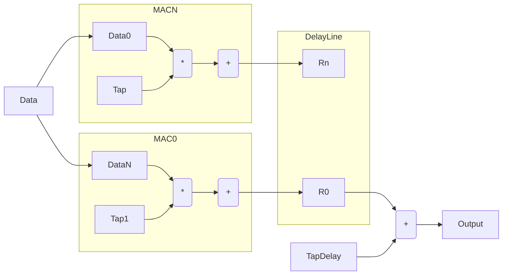

## Feedforward operation

The feedforward operation is a matrix multiplication with a bias addition.  The data flow is ordered to always work with MAC operations and avoid the use of an adder tree. 

A block diagram of the operation is shown below. 

The block contains N shared MAC units, a delay line, a bias addition and a nonlinearity. The data flow operates as follows : 

1. The input data is multiplied by the tap 
2. The result is accumulated unless it is the first operation
3. When the operation is complete the data is latched at the output into the delay line
4. This delay line is then fed into the bias addition serially. `This could/should be done using the accumulator`
5. The output of the bias addition block is fed into the nonlinearity and output

The access ordering is shown in the table below for an example which has K MAC units and N total inputs. The ordering is always done so that an output is completed without having to be stored back into memory. 

| Type          | 0       | 1      | K      | K+1     | N       |
| ------------- |:-------:| ------:| ------:| -------:| -------:|
| Tap (Vector)  | T0      |   T1   |   TK   | T(K+1)  | TN      |
| Data          | D0      |   D1   |   DK   | D0      | DK      |
| Bias          | B0      |   B1   |   BK   | B0      | BK      |

