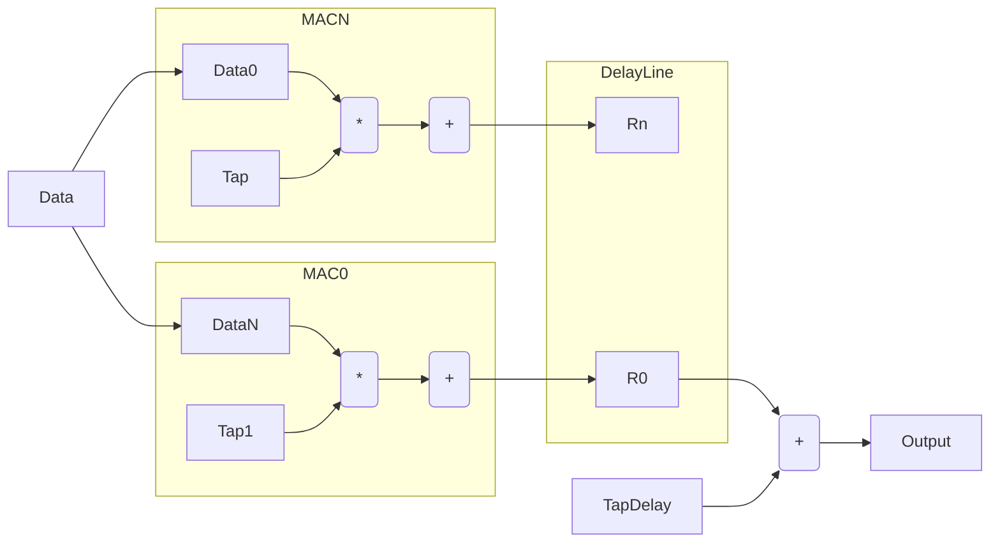

# Feedforward operation

The feedforward operation consists of a matrix multiplication, bias addition and nonlinear operation. 
 
$$y = f(Hx + b$$)

 
This is done using MAC units in parallel and a vector bias addition and non-linear operation serially. 

----
A block diagram of the operation is shown below. The block contains N shared MAC units, a delay line, a bias addition followed by a non-linearity. The input data comes in serially and the output data is converted to parallel through the delay line. 

## Data Flow

The data flow of the system is selected to avoid an adder tree and minimimize memory access. This ordering is shown below when the number of MAC units can split the matrix in 4 sections. 

-----

$$\left(\begin{matrix}
  1st & 2nd \\
  3rd & 4th
\end{matrix}\right)$$

-----

1. The input data is multiplied by the taps with the data being input at 1 sample per input 
2. The accumulator takes the previous results unless it is the first input sample
3. When the summation is complete the parallel outputs are latched into a delay line
4. The delay line is fed serially into the bias circuit. 
5. The output of the bias addition block is fed into the nonlinearity and output serially

-----

The access ordering is shown in the table below for an example which has K MAC units and N total inputs. The ordering is always done so that an output is completed without having to be stored back into memory. 

| Type          | 0       | 1      | K      | K+1     | N       |
| ------------- |:-------:| ------:| ------:| -------:| -------:|
| Tap (Vector)  | T0      |   T1   |   TK   | T(K+1)  | TN      |
| Data          | D0      |   D1   |   DK   | D0      | DK      |
| Bias          | B0      |   B1   |   BK   | B0      | BK      |

