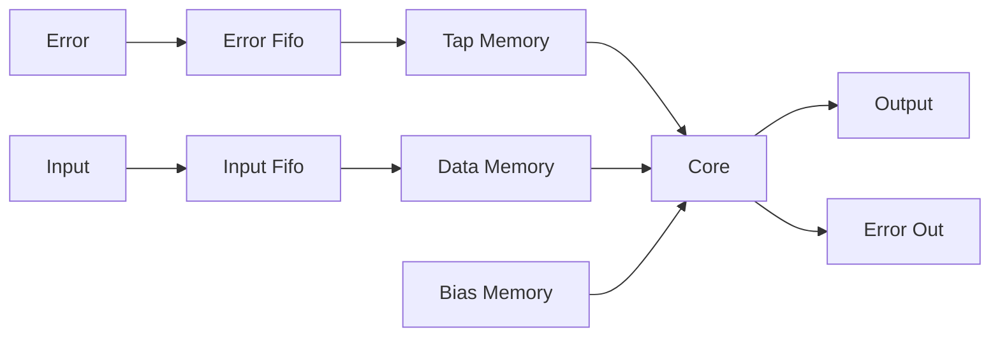
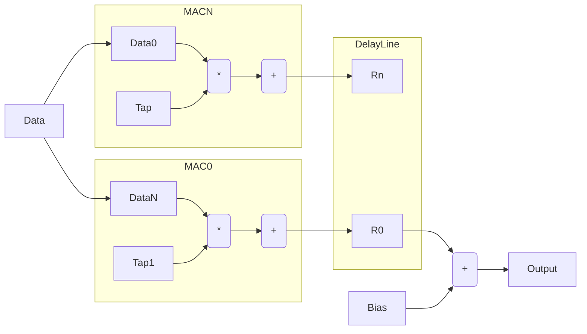

## Neural Network Stage

Each stage of the network is self contained block which contains a set of control as well as memory. A high level block diagram is shown below. 

This architecture was selected for simplicity but is not required. Sharing between stages as well as setting up resource pools for sharing is possible. For the current use cases there didn't seem to be advantages due to the full loading of the memories. 

## Neural Core Architecture 

The core of the neural stage contains a set of MAC units and some glue logic which supports the required network operations. 

* Feedforward operation
* Error Backpropagation
* Tap/Bias Updates

These are all matrix operations and utilize the same basic underlying set of MAC units with different ordering of the inputs. In general the block has the structure shown below with slight variations to handle the different matrix operations. 

