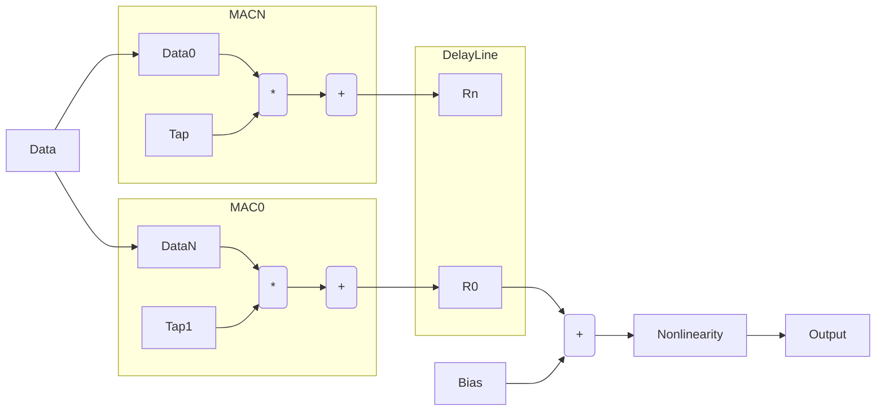

## Error Update operation

The error update calculation uses the same structure as the feedforward operation with a different input configuration. For this case the values used in the update equation are the error and the taps instead of the taps and data. 

The block diagram of the operation is shown below. 

    
The operation shown above is very similar to the feedforward operation with the following differences 

1. The tap input is the error (This is made more efficient by storing the tap and error in the same memory)
2. The output of the block is parallel and is written to the tap memory
3. The bias update is a scalar addition not shown in the diagram which uses the error directly

The ordering of the operations is shown below

| Type          | 0       | 1      | K      | K+1     | N       |
| ------------- |:-------:| ------:| ------:| -------:| -------:|
| Tap (Vector)  | E0      |   E0   |   E0   | E1      | E1      |
| Data          | D0      |   D1   |   DK   | D0      | DK      |
| Bias          | B0      |   B1   |   BK   | B0      | BK      |

For this case, the error is kept constant while the data is changing at the input. 
