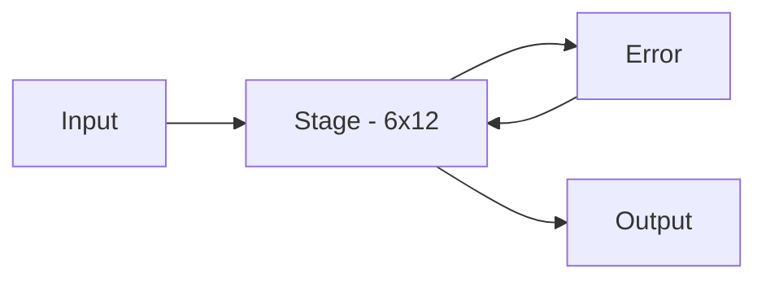
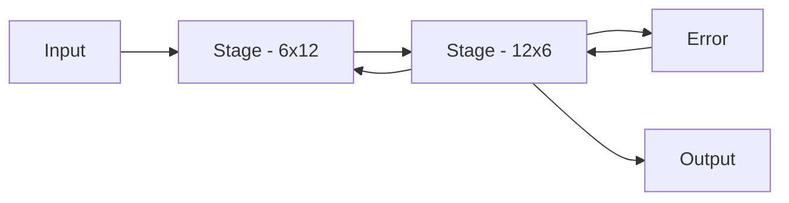
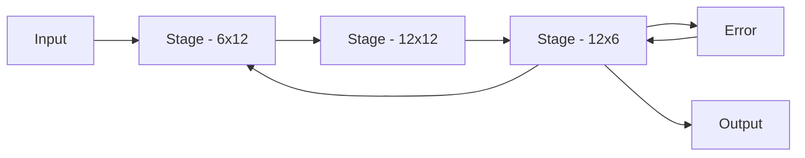

## Basic Examples

A detailed description of these examples is coming but for now the blocks contain basic descriptions and links
to the code and results.

### Single Stage Neural Network

This is a simple test case which contains a network with a single stage with 6 inputs, 12 outputs utilizing 6 MAC blocks.

* [Results](https://github.com/andywag/NeuralHDL/blob/master/docs/results/SingleStage.ipynb)
* [Output Directory - Generated Source and Results](https://github.com/andywag/NeuralHDL/tree/master/tests/simple)
* [Block Generator](https://github.com/andywag/NeuralHDL/tree/master/src/test/scala/com/simplifide/generate/neural/SingleStageTest.scala)

### Two Stage Neural Network

This is a simple test case which contains a network with 2 fully connected stages.

1. The first stage has 6 inputs and 12 outputs and uses 6 MAC units
1. The second stage has 12 inputs and 6 outputs and uses 6 MAC units

* [Results](https://github.com/andywag/NeuralHDL/blob/master/docs/results/TwoStage.ipynb)
* [Output Directory - Generated Source and Results](https://github.com/andywag/NeuralHDL/tree/master/tests/full)
* [Block Generator](https://github.com/andywag/NeuralHDL/tree/master/src/test/scala/com/simplifide/generate/neural/DoubleStageTest.scala)

### Three Stage Neural Network

This is the first realistic test case which contains a 3 stage network with 12 hidden neurons.

1. The first stage has 6 inputs and 12 outputs and uses 6 MAC units
1. The second stage contains 12 inputs and 12 outputs and uses 6 MAC units
1. The third stage has 12 inputs and 6 outputs and uses 6 MAC units

* [Results](results/DoubleStage.jpynb)
* [Output Directory - Generated Source and Results](../../tests/hidden)
* [Block Generator](../src/test/scala/com/simplifide/generate/neural/HiddenStageTest.scala)