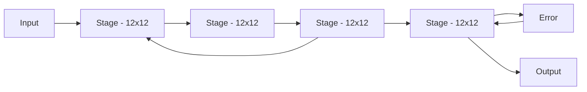

# Basic Examples

The purpose of the examples in this section are to prove out the hardware design created by generated and not delve into the signal processings of the network. All of the networks created use the same basic infrastructure which are generalized to test network configurations. The examples also contain building block tests which are used to verify the functionallity of the network by testing each stage individually. The examples shown below starts with a single stage network and then is expanded to larger networks. 

The first test created was based on a Braille example shown below so many of the tests use configurations based on these sizes. This example was chosen since it was not based on a power of 2 and had unity outputs which made debugging of the design more straightforward. 

[Braille Example](http://neuroph.sourceforge.net/tutorials/Braille/RecognitionOfBrailleAlphabetUsingNeuralNetworks.html)

## Example Configuration

The framework for all designs is common so each of the examples below are based on using the same design and setting. Each example will contain links to the 

* The test results which is a jupyter notebook results which describes the converging of the network
* The results directory which contains the generated rtl
* The scala code used to generate the network

-----

Given the nature of the tests and number of configurations, the scala code for the tests is being refactored down to only the smallest changes for the tests. The basic building blocks for the network configurations can be found in the following locations. 

* [Test Generator Location](https://github.com/andywag/NeuralHDL/tree/master/src/test/scala/com/simplifide/generate/neural)
* [Main Generator Test Block](https://github.com/andywag/NeuralHDL/tree/master/src/test/scala/com/simplifide/generate/neural/BasicNetworkTest.scala)

-----

The generator code is based on an internal DSL (Domain Specific Language) for RTL generation and is a bit more complicated. The basic building blocks for the neural network blocks ban be found in the following location : 

* [Generator Location](https://github.com/andywag/NeuralHDL/tree/master/src/main/scala/com/simplifide/generate/blocks/neural)

-----
## Basic Example Testing

The testing of the blocks is done using : 

* Scala Framework : Generates the hardware and the test framework
* Verilator       : Runs a verilog simulator when the test is complete
* Numpy           : Analyzes the results by looking at the output, taps, and error. Declares an error when the MSE of the error is greater than a user defined threshold

-----
## Four Stage Example

There are quite a few test cases with different configurations which can mainly be found in these files

* [Single Stage Test](https://github.com/andywag/NeuralHDL/blob/master/src/test/scala/com/simplifide/generate/neural/SingleStageTest.scala)
* [Two Stage Test](https://github.com/andywag/NeuralHDL/blob/master/src/test/scala/com/simplifide/generate/neural/TwoStageTest.scala)
* [MultiStage Test](https://github.com/andywag/NeuralHDL/blob/master/src/test/scala/com/simplifide/generate/neural/MultiStageTest.scala)

-----

This test is a 4 stage test with 12x12 inputs following the block diagram below. 



The results and general information about the test case can be found at the following links. 

* [Results](https://github.com/andywag/NeuralHDL/blob/master/docs/results/MultiStage.ipynb)
* [Output Directory - Generated Source and Results](https://github.com/andywag/NeuralHDL/tree/master/tests/four_12_12)
* [Block Generator](https://github.com/andywag/NeuralHDL/tree/master/src/test/scala/com/simplifide/generate/neural/MultiStageTest.scala)

-----

The generator code for this example is also shown below. This main controls a set of configurations for the test. 


```scala
class FourSame(siz:Int) extends TwoStageTest {
  // Fifo Depths
  override lazy val dataFill      = Seq(20,20,40,20)
  override lazy val errorFill     = Seq(10,10,10,10)
  override lazy val outputFill    = Seq(10,10,10,10)
  override def blockName: String = s"four_${siz}_${siz}"
  override lazy val numberNeurons = Seq(siz,siz,siz,siz,siz)
  // Dimensions of Network
  override lazy val dimensions = Seq((siz,siz),(siz,siz),(siz,siz),(siz,siz))
  // Type of Taps (Random Taps with Normal Distribution)
  override lazy val tapType:BasicNetworkTest.TAP_TYPE = BasicNetworkTest.RAND_TAPS
  override lazy val tapScale:Seq[Double] = Seq(.5,.5,.5,.5)

  override lazy val tapEnable = List(1,1,1,1)
  override lazy val biasEnable = List(1,1,1,1)
  override lazy val gain = Seq(15,11,9,7).map(x => x)
  override def getTestLength = BasicTestInformation.tapLength*math.pow(2.0,8).toInt
  override lazy val disableNonlinearity = true

}

class Four12 extends FourSame(12) {
  override def waveformEnable = true
}


```

