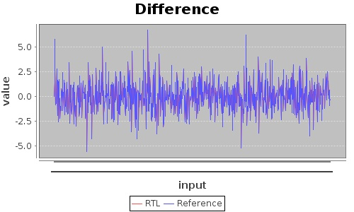
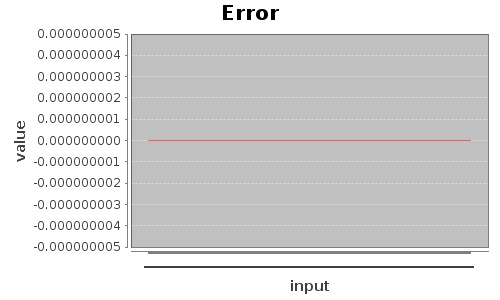

# testNeuron

This module is a block test wrapper for the a floating point neuron block. This is a random test using a Gaussian input
over the data, taps and bias. All the inputs and outputs are floating point.

## Test Results

### Plot of RTL vs Reference Data

### Difference between Rtl and Reference Data

## Reference Code for Test
* [Testbench (Verilog)](../test/testNeuron.v)
* [Test Wrapper (C++)](../test/testNeuron.cpp)
* [Test Generator](../../../src/test/scala/com/simplifide/generate/neural//NeuronTest.scala)
* [Code Generator](../../../src/main/scala/com/simplifide/generate/blocks/neural//Neuron.scala)

        