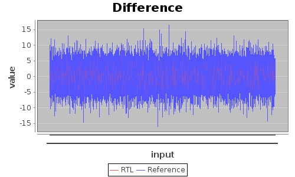
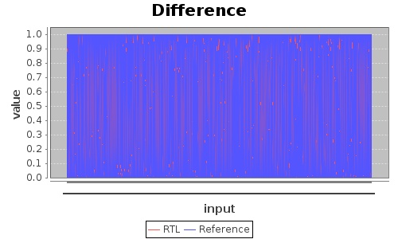
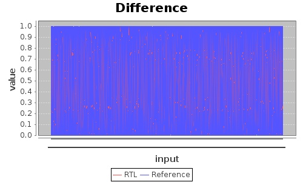
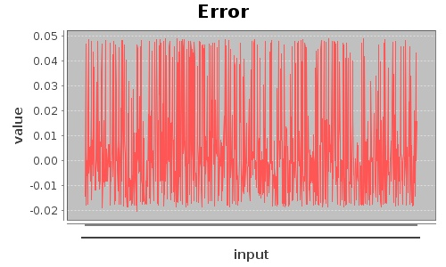

# testNeuronStage

This module is a block test wrapper for the a fully connected neuron stage. This is the most basic test which
has the same number of MAC units as neurons and an equal number of inputs and outputs.

## Test Results

### Plot of RTL vs Reference Data for output before non-linearity

### Error between Rtl and Reference Data before non-linearity

### Plot of RTL vs Reference Data for output before non-linearity

       |
### Error between Rtl and Reference Data before non-linearity
       |

## Reference Code for Test
* [Testbench (Verilog)](../test/testNeuronStage.v)
* [Test Wrapper (C++)](../test/testNeuronStage.cpp)
* [Test Generator](../../../src/test/scala/com/simplifide/generate/neural//NeuronStateTest.scala)
* [Code Generator](../../../src/main/scala/com/simplifide/generate/blocks/neural//NeuronStage.scala)

        