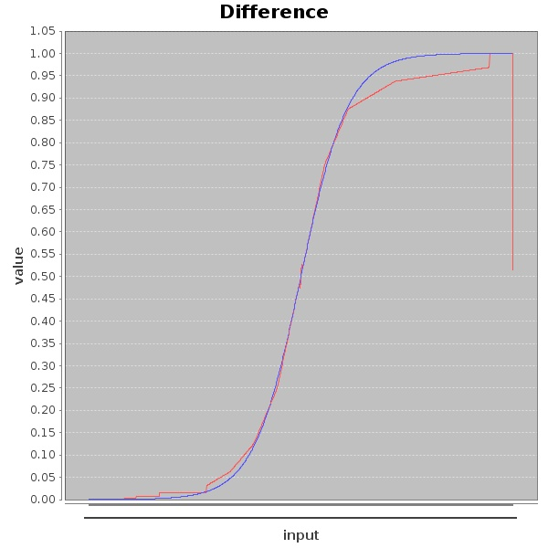
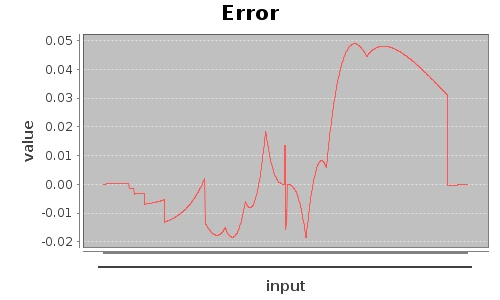

# sigmoid

This document details the block design of sigmoid. It starts out with a description of the design followed
by the test descriptions and results.

This block contains a sigmoid nonlinear operation based on "Myers and Hutchinson" piecewise linear approximation.
There are a few slight differences in the operation to simplify things due to the floating point aspect but
there output error has similar properties with a maximum error of ~4.8%. This block is more naturally done using
fixed point which inherently is internally done in the internal shifters of this block

## Input/Output
* output out      - float_24_8   : Output of the block
* input  data      - float_24_8    : Input of the block

## Generator Code

The code used to generate this code is relatively complex

* [Code Generator](../../../src/main/scala/com/simplifide/generate/neural//Sigmoid.scala)

# testSigmoid

This module is a block test wrapper for the sigmoid block. The block tests the output of this block
against a linear ramp over a range of -9.0 to 9.0. The output of this is matched
against a reference model which give a maximum error of around 4.8%.

## Test Results

### Plot of RTL vs Reference Data

### Actual Difference between Rtl and Reference Data

## Reference Code for Test
* [Testbench (Verilog)](../test/testSigmoid.v)
* [Test Wrapper (C++)](../test/testSigmoid.cpp)
* [Test Generator](../../../src/test/scala/com/simplifide/generate/neural//SigmoidTest.scala)
* [Code Generator](../../../src/main/scala/com/simplifide/generate/neural//Sigmoid.scala)

        

